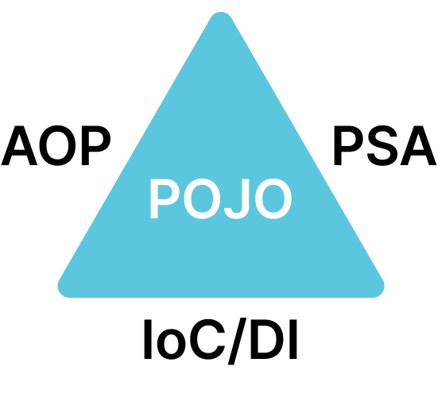

# spring-tutorial-24th
CEOS 백엔드 24기 스프링 튜토리얼

## 1️⃣ spring이 지원하는 기술들(IoC/DI, AOP, PSA 등)을 자유롭게 조사해요

스프링에는 세가지 핵심 기술이 있습니다. 스프링 삼각형이라고도 부르는 3대 핵심 요소는 IoC/DI, AOP, PSA로, 이들은 서로 매우 긴밀하게 협력하여 동작합니다. 이들의 공통된 최종 목표는 순수한 자바 객체(POJO)를 유지하면서 결합도를 낮추고 유연한 서버 애플리케이션을 만드는 것입니다.



근데? 사실 백번 읽어봐도 모르겠으니! 하나씩 공부해봅시다.

### ① IoC/DI

IoC/DI는 제어의 역전(Inversion of Control)과 의존성 주입(Dependency Injection)의 줄임말입니다.
Spring에서는 **IoC 컨테이너**가 객체 간의 의존성을 주입합니다.
여기서 '의존성 주입'은 '제어의 역전'의 특수한 형태입니다.
<br><br>
예시를 통해 조금 더 쉽게 살펴보도록 하겠습니다.
<br>
요리사가 국수를 요리하는 상황을 자바 코드로 비교해봅시다.

```java
public class Chef {
private PorkSpine meat;

    public Chef() {
        // 요리사가 직접 구체적인 객체를 생성합니다 (제어권이 요리사에게 있음)
        this.meat = new PorkSpine(); 
    }

    public void cook() {
        System.out.println("푹 고아낸 " + meat.getName() + " 국수 완성!");
    }
}
```
위 코드에서, 요리사는 직접 구체적인 객체를 생성합니다. 즉, 제어권이 요리사에게 있죠. 하지만 이 경우 돼지등뼈가 소진되면 어떻게 해야 할까요? 요리사가 직접 정육점까지 뛰어가 돼지등뼈를 사와야 하는 상황이 발생합니다.
<br>
하지만 요리사가 아닌, 사장님이 출근길에 고기를 사오면 훨씬 좋지 않을까요? 그리고 돼지등뼈가 없어도, 다른 고기를 넣을 수 있으면 더 편하지 않을까요?

```java
@Component
public class Chef {
    private final Meat meat;

    // 요리사는 추상적인 '고기(Meat 인터페이스)'면 뭐든 받아서 요리합니다.
    // 객체 생성과 공급의 제어권(IoC)이 스프링 사장님에게 넘어갔습니다!
    @Autowired 
    public Chef(Meat meat) {
        this.meat = meat; 
    }

    public void cook() {
        System.out.println("푹 고아낸 " + meat.getName() + " 국수 완성!");
    }
}
```
식당 사장님, 즉 스프링 컨테이너에게 제어권을 넘기면 요리사는 "고기"이기만 하면 뭐든 받아 요리하면 되는 편리한 상황이 됩니다.
또한 코드가 인터페이스에만 의존하게 되어 결합도가 낮아지죠.
<br>
위 예시 코드에서 본 방식은 생성자 주입(Constructor Injection) 방식입니다.
<br>
사실 의존성을 주입하는 방법에는 생성자 주입 뿐만 아니라 수정자 주입(Setter Injection), 필드 주입(Field Injection) 방식도 있습니다. 하지만 공식 문서에서는 특히 생성자 주입 방식을 권장합니다.
- 우선 생성 시점에 딱 한 번만 호출되므로 주입받은 의존성이 런타임에 변하지 않음(**불변성**)을 보장합니다.
- 또한 필드에 final 키워드를 사용할 수 있어, 만약 의존성 주입을 깜빡하더라도 애플리케이션 실행 전 컴파일 단계에서 바로 에러를 잡아낼 수 있습니다. 즉, **필수 의존성**을 보장하는거죠.
- 그 외에도 순환 참조를 방지할 수 있고, 테스트 시에 Mock 객체를 사용하기에 용이하다는 등의 이점이 있습니다.

그럼 이제 제어가 역전된다는게 어떤 느낌인지 알겠죠?
<br>
만약 아직도 이해가 안된다면 [의존성 주입 3분만에 이해하기 (Dependency Injection, Inversion of Control)](https://youtu.be/1vdeIL2iCcM?si=_hvHcxvKs-Z8tq3b) 영상을 추천드립니다.
<br>
이해가 되셨다면! 실제 스프링에서는 아래와 같이 제어의 역전이 사용됩니다. 

```java
import org.springframework.stereotype.Service;

@Service
public class UserService {
    // 구체적인 구현체가 아닌 인터페이스에 의존
    private final UserRepository userRepository;

    // 스프링 컨테이너가 UserService를 생성할 때 UserRepository 구현체를 자동으로 주입 (DI)
    public UserService(UserRepository userRepository) {
        this.userRepository = userRepository;
    }
    
    public void registerUser() {
        userRepository.save();
    }
}

```

### AOP

- Aspect-Oriented Programming
- 객체 지향 프로그래밍을 보완하는 구조
- 애플리케이션 전반에 흩어져 있는 교차 관심사(ex. 로깅, 보안, 트랜잭션)를 별도의 모듈(Aspect)로 분리
- 스프링은 런타임 프록시 방식으로 이를 구현

### PSA

- 일관된 서비스 추상화 (Service Abstraction)
- Transaction, Cache, Messaging 등의 인프라 기술을 사용할 때, 특정 기술(JDBC, JPA, Hibernate 등)의 API에 종속되지 않고 동일한 프로그래밍 모델을 사용할 수 있도록 추상화를 제공

```java
import org.springframework.stereotype.Service;
import org.springframework.transaction.annotation.Transactional;

@Service
public class OrderService {

    // JDBC, JPA, JTA 등 데이터 접근 기술이 무엇이든 상관없이
    // 동일한 어노테이션 하나로 트랜잭션 경계를 설정하고 롤백/커밋을 관리
    @Transactional
    public void placeOrder(Order order) {
        inventoryRepository.decreaseStock(order.getItemId());
        orderRepository.save(order);
    }
}

```

---

## 2️⃣ Spring Bean 이 무엇이고, Bean 의 라이프사이클과 Bean Scope에 대해 조사해요

### 1. Spring Bean, Lifecycle, Bean Scope

- **Spring Bean 이란?**<br>
  스프링 IoC 컨테이너에 의해 인스턴스화되고, 조립되며, 관리되는 객체
- **Bean Lifecycle (생명주기)**<br>
  - 스프링 컨테이너는 빈의 생성부터 소멸까지의 과정을 관리하며, 특정 시점에 개발자가 개입할 수 있는 콜백(Callback)을 제공
  - **과정:** 인스턴스화 → 의존성 주입(DI) → 초기화 콜백(Initialization) → 빈 사용 → 소멸 콜백(Destruction)
- **Bean Scope (스코프)**
  - 빈이 생성되고 존재하는 범위
  - **`singleton` (기본값):** 스프링 컨테이너당 단 하나의 공유 인스턴스만 생성되는 것
  - **`prototype`:** 컨테이너에 빈을 요청(주입)할 때마다 매번 새로운 인스턴스를 생성하는 것
  - **웹 전용 스코프:** 웹 환경에서만 유효하며 `request`(HTTP 요청당 하나), `session`(HTTP 세션당 하나), `application`(ServletContext당 하나), `websocket` 등

### 2. Java 어노테이션(Annotation)과 구현

- 어노테이션은 프로그램 소스 코드에 추가할 수 있는 메타데이터(Metadata)
- 프로그램의 비즈니스 로직 자체에는 직접적인 영향을 주지 않지만, 컴파일러에게 정보를 제공하거나 런타임 시 특정 기능을 수행하도록 프레임워크에 힌트를 준다.
- **Java에서의 구현:**
  - `@interface` 키워드를 사용하여 선언
  - **메타 어노테이션:** `@Target`(적용 대상: 클래스, 메서드, 필드 등)과 `@Retention`(유지 정책: Source, Class, Runtime)을 통해 동작 방식을 정의 
  - 스프링과 같은 프레임워크는 주로 `@Retention(RetentionPolicy.RUNTIME)`으로 설정된 어노테이션을 **리플렉션(Reflection) API**를 통해 런타임에 읽어들여 부가적인 처리를 수행

### 3. 스프링의 어노테이션 기반 Bean 등록 과정

스프링에서 `@Component`나 `@Bean` 어노테이션을 사용해 빈을 등록할 때 컨테이너 내부에서 일어나는 과정

1. **메타데이터 읽기:** 설정 클래스(예: `@Configuration`이 붙은 클래스) 읽기
2. **BeanDefinition 생성:** 컨테이너는 즉시 객체를 생성하지 않고, 어노테이션 정보를 바탕으로 빈의 설계도격인 **`BeanDefinition`** 객체를 생성. 여기에는 빈의 클래스 이름, 스코프, 초기화 메서드, 의존성 정보 등이 담김.
3. **레지스트리 등록:** 생성된 `BeanDefinition`을 컨테이너 내부의 `BeanDefinitionRegistry`에 등록
4. **인스턴스화 및 의존성 주입:** 빈 생성이 필요한 시점(싱글톤의 경우 컨테이너 초기화 시점)에 `BeanDefinition`을 기반으로 실제 Java 객체를 생성(Reflection 활용)하고, 필요한 의존성을 주입(DI)

### 4. `@ComponentScan`의 컴포넌트 탐색 과정 심층 분석

`@ComponentScan`: 스프링이 어디서부터 컴포넌트를 찾을지(`basePackages`) 지정하고, 이를 자동으로 빈으로 등록하는 기능

1. **클래스패스 스캐닝 (Classpath Scanning):** `ClassPathBeanDefinitionScanner`가 지정된 베이스 패키지와 그 하위 패키지의 디렉토리를 파일 시스템이나 JAR 파일 내의 클래스패스에서 스캔
2. **ASM을 통한 바이트코드 분석 (클래스 로딩 방지):** 스프링은 스캔 과정에서 메모리 낭비와 부작용을 막기 위해 런타임에 클래스를 직접 메모리에 로딩(Class Loading)하지 않고 대신 ASM이라는 바이트코드 조작 라이브러리를 기반으로 한 `MetadataReader`를 사용하여 `.class` 파일의 메타데이터만 빠르게 읽음
3. **필터링 (Filtering):** 읽어들인 메타데이터 중 `@Component` 어노테이션(또는 이를 포함한 `@Service`, `@Repository`, `@Controller` 등의 메타 어노테이션)이 존재하는지 확인
4. **BeanDefinition 등록:** 필터를 통과한 클래스들에 대해 `BeanDefinition`을 생성하고 레지스트리에 등록하여 이후 컨테이너가 빈으로 관리하게 함

---

## 3️⃣ 🔥Spring MVC를 심층 분석해요🔥

### 1. MVC 패턴 vs. Spring MVC

- **MVC 패턴 (Model-View-Controller):**<br>
  소프트웨어 공학에서 애플리케이션을 세 가지 역할로 나누는 **설계 아키텍처**로, 데이터(Model), 사용자 인터페이스(View), 그리고 이 둘을 연결하며 제어하는 비즈니스 로직(Controller)을 분리하여 유지보수성을 높이는 것이 목적
- **Spring MVC (`spring-webmvc`):**<br>
  스프링 프레임워크가 제공하는 웹 모듈로, MVC 아키텍처 패턴을 Java의 Servlet API를 기반으로 구현한 **실제 프레임워크**. 일반적인 MVC 구조에 중앙 집중식 요청 처리기인 **프론트 컨트롤러(Front Controller)** 패턴을 도입하여 웹 요청 처리를 표준화하고 유연한 확장을 제공.

### 2. Servlet과 웹 요청 처리

* **Servlet (서블릿):** Java를 사용하여 웹 서버의 기능을 확장하고 동적인 HTTP 응답을 생성하기 위한 자바 표준 인터페이스(규약)<br>
  (Spring MVC 자체가 이 Servlet API를 기반으로 구축되어 있음)
* **웹 요청 처리 흐름:**
  1. 클라이언트(브라우저)가 HTTP 요청을 서버로 전송
  2. 서블릿 컨테이너가 요청을 받아 `HttpServletRequest`와 `HttpServletResponse` 객체를 생성
  3. 요청 URL에 매핑된 서블릿의 `service()` 메서드를 호출. (HTTP 메서드에 따라 내부적으로 `doGet`, `doPost` 등으로 분기)
  4. 로직 처리가 끝나면 `HttpServletResponse`를 통해 클라이언트에게 응답을 보내고, 생성되었던 Request/Response 객체를 소멸시킴

### 3. 톰캣(Tomcat)과 WAS

* **WAS (Web Application Server):** 정적 콘텐츠(HTML, 이미지)만 제공하는 웹 서버와 달리, DB 조회나 복잡한 비즈니스 로직을 통해 **동적인 콘텐츠**를 생성하고 제공하는 미들웨어. 내부적으로 서블릿을 실행할 수 있는 '서블릿 컨테이너'를 포함.
* **Tomcat:** 아파치 소프트웨어 재단에서 개발한 가장 대표적인 오픈소스 서블릿 컨테이너이자 WAS. 스프링 부트(Spring Boot)는 이 톰캣을 애플리케이션 내부에 내장(Embedded Tomcat)하여 제공하므로, 개발자가 별도의 서버 설정 없이 `main()` 메서드 실행만으로 웹 서버를 띄울 수 있음.

### 4. DispatcherServlet과 웹 요청 동작 흐름

스프링 공식 문서는 Spring MVC의 핵심을 `DispatcherServlet`으로 정의함. 이는 모든 HTTP 요청을 가장 먼저 받아 적절한 컴포넌트로 요청을 위임하는 **프론트 컨트롤러(Front Controller)** 역할을 수행.

**동작 흐름:**

1. 요청 수신
2. 핸들러 조회 (`HandlerMapping`)
3. 어댑터 조회 및 실행 (`HandlerAdapter`)
4. 결과 처리 및 응답 반환

---

이번 과제를 수행하면서 관련된 개념들에 대한 유튜브 영상들로부터 많은 도움을 받았습니다. 제가 집중력이 짧아 영상의 도움을 받은 것도 있지만... 생각보다 유튜브에 고수들이 너무나 쉽게 풀어서 설명한 영상들이 참 많답니다? 모두 알고 계시겠지만 한번 상기시켜드리고 갑니다...👍